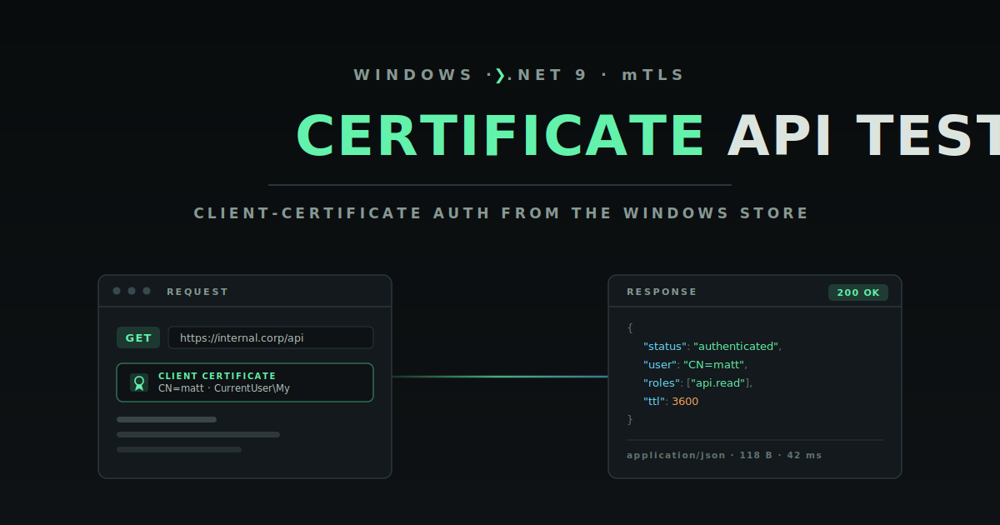
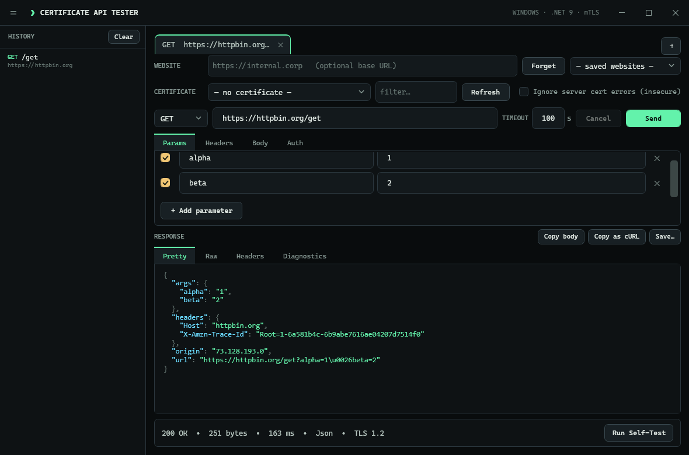
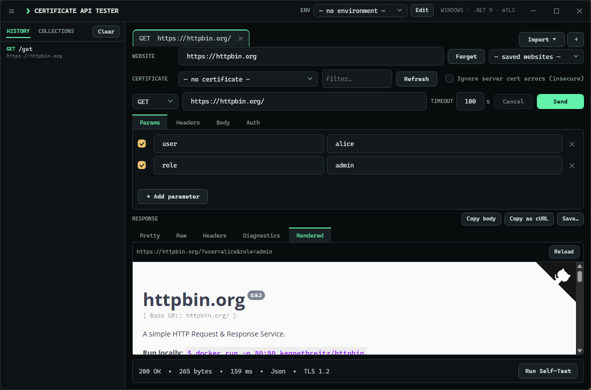
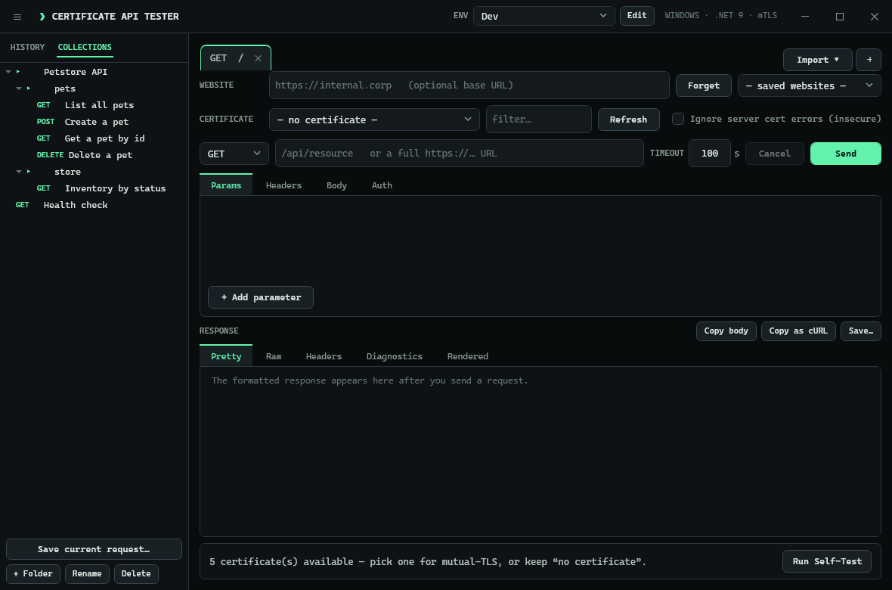
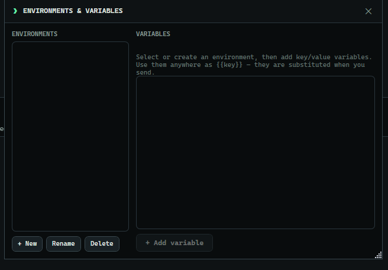
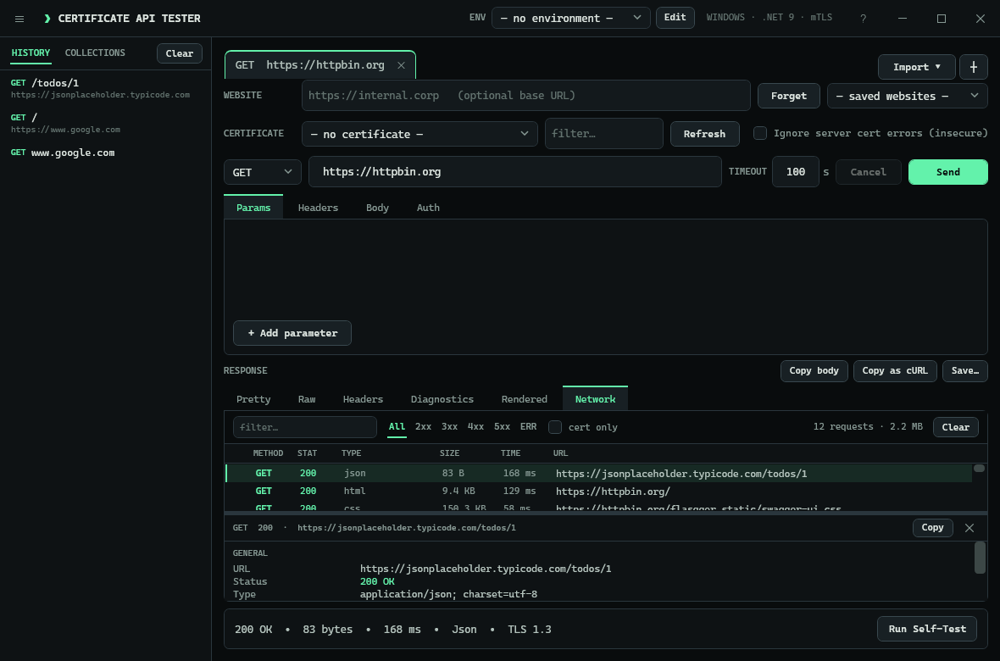
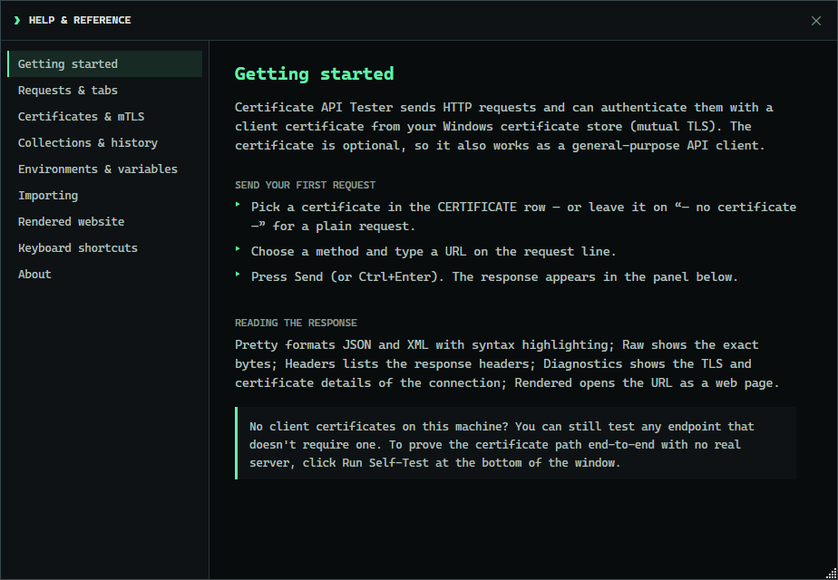

<div align="center">

  

  **A Windows desktop API tester that authenticates to endpoints with a client certificate from your Windows certificate store (mTLS) — and renders whatever the endpoint returns, even when you don't know its format.**

  [](LICENSE)
  [](https://github.com/Real-Fruit-Snacks/windows-cert-api-tester/releases)
  [](#requirements)
  [](https://dotnet.microsoft.com/)
  [](https://github.com/Real-Fruit-Snacks/windows-cert-api-tester/actions/workflows/ci.yml)

  [Documentation](https://real-fruit-snacks.github.io/windows-cert-api-tester/) · [Download](https://github.com/Real-Fruit-Snacks/windows-cert-api-tester/releases/latest) · [Report an issue](https://github.com/Real-Fruit-Snacks/windows-cert-api-tester/issues)

</div>

---

## Overview

Some internal sites and APIs don't take a password — they ask your browser to "choose a certificate," then complete a mutual-TLS handshake with a client certificate issued to you and stored in your Windows certificate store. Testing those endpoints from a normal API client is awkward: most tools want the certificate and its private key as files on disk, which enterprise and smart-card certificates deliberately don't allow.

Certificate API Tester talks to those endpoints directly. You pick a certificate from your Windows store, compose a request, and send it — the operating system performs the signing during the TLS handshake, so the private key never has to leave the store (and never has to be exportable). Because you often only know the endpoint and not the shape of what comes back, the response viewer figures out the format for you and pretty-prints it. And when the target is a **web page** rather than an API, a *Rendered* tab opens it as a browser would — fetching every resource on the page through your certificate. Because the certificate is optional, it also doubles as a general-purpose API client for anything else.

It runs as a single self-contained `.exe` with no external dependencies — no installer, no admin rights, and no .NET runtime required on the machine. Copy the file and run it.

<div align="center">
  
</div>

## Features

- **Pick a client certificate from the Windows store** — lists certificates in `CurrentUser\My` (optionally `LocalMachine\My`) with subject, issuer, thumbprint, and expiry, flags the ones meant for client authentication, and has a filter box for finding one quickly. The private key is never exported; Windows signs the handshake, so smart-card and non-exportable certificates work.
- **Certificate optional — a general API tester too** — leave the picker on **"— no certificate —"** (the default) to send an ordinary request, so it works just as well against endpoints that don't require mutual TLS.
- **Full request builder** — method (GET/POST/PUT/PATCH/DELETE/HEAD/OPTIONS), URL, an enable/disable key-value **query-parameter grid** and **headers grid**, **Bearer/Basic auth** helpers, a request body with a **content-type selector**, a **timeout** field, and a **Cancel** button for in-flight requests.
- **Request tabs** — keep several requests open side by side, each with its own website, method, parameters, headers, body, auth, certificate, and response. Add a tab with `+` or **Ctrl+T**, close it with its `✕` or **Ctrl+W**; your open tabs are there again next time you launch.
- **Query parameters** — a dedicated **Params** tab with an enable/key/value grid. Paste a URL with a `?query` and it splits into the grid automatically; the grid is recombined (correctly encoded) onto the URL when you send.
- **Collections** — save named requests into folders and reopen them in a tab. Switch the sidebar between **History** and **Collections**; save the current request, organise it in folders, rename, or delete. Collections persist between sessions.
- **Environments & variables** — define `{{variable}}` values per environment (Dev / Staging / Prod) and switch from the **ENV** selector in the title bar. Variables are substituted in the URL, query, headers, body, and auth when you send — stored requests keep the raw `{{tokens}}`, and any token with no value is flagged in the status line.
- **Import from cURL** — paste a `curl` command and it opens a ready-to-send tab with the method, URL, query, headers, body, and auth filled in (understands `-X`, `-H`, `-d`, `-u`, `-k`, Bearer headers, quoting, and line continuations).
- **Import OpenAPI / Swagger** — point it at a JSON OpenAPI 3.x or Swagger 2.0 file to generate a collection of requests, foldered by tag, with the server as each request's website.
- **Rendered website view** — a **Rendered** response tab opens the current URL as a web page, fetching *every* resource (document, CSS, JS, images, XHR) with your selected client certificate — so a certificate-protected internal site renders fully, not just its HTML. It loads on demand and uses the Edge WebView2 runtime included with Windows 11.
- **A response viewer for unknown formats** — reads the `Content-Type` but doesn't trust it blindly: pretty-prints JSON and XML with **syntax highlighting**, shows HTML/text, and hex-dumps binary. When the content type is missing or misleading it *sniffs* the body (JSON → XML → text → binary). Pretty / Raw / Headers / Diagnostics views are always available.
- **Connection diagnostics** — see the negotiated **TLS version and cipher**, whether your client certificate was **actually presented** to the server, and the server's certificate (subject, issuer, thumbprint, expiry, and chain).
- **Network trace** — a **Network** tab, like a browser's network panel: every HTTP call is logged — the request you sent *and* every resource the Rendered view fetches — with method, status, type, size, timing, and a marker when it used your client certificate. Filter by text, status class (2xx–5xx, errors), or cert-only; click a row for a resizable details pane with its headers; right-click to copy the URL or a matching curl command.
- **Saved websites** — save a base URL (e.g. `https://internal.corp`) and the URL box becomes just the path after it, so you can fire off `/api/thing`, `/api/other` without retyping the host.
- **Request history** — a sidebar of recent requests, labelled by path (with the host beneath). Click one to reload the *entire* request — website, certificate, headers, auth, timeout, and body — **and** the response it returned. The app also remembers your window, last certificate, and settings between runs.
- **Copy & export** — copy the response body, copy the request **as a cURL command**, and save any response (including binary) with a sensible file extension.
- **Clear failure messages** — distinguishes "server refused the certificate," "the server's own certificate isn't trusted," a network/DNS error, and a timeout.
- **Reach internal sites behind a private CA** — an explicit, off-by-default *Ignore server certificate errors* toggle (clearly labelled insecure).
- **Honors your proxy** — follows the machine's configured proxy, including "Automatically detect settings" (WPAD) and a "Use automatic configuration script" (PAC) from Internet Options, authenticating with your Windows credentials when required.
- **Built-in self-test** — a *Run Self-Test* button stands up a local mutual-TLS server on your own machine and proves the whole certificate-authentication path end to end, **no real endpoint required.**
- **Built-in help** — a **?** in the title bar (or **F1**) opens a Help & Reference window that walks through every feature, lists the keyboard shortcuts, and shows an About panel. It's all embedded, so it works even with no web access.
- **Keyboard-friendly and portable** — shortcuts for everything (below), a fully themed dark UI, and a single self-contained executable.

## Screenshots

**Render a certificate-protected website — every resource (HTML, CSS, JS, images, XHR) is fetched with your client certificate**

<div align="center">
  
</div>

**Organise saved requests into collections, and switch between environments of `{{variables}}`**

<div align="center">
  
  <br/><br/>
  
</div>

**A network trace — every request the page made, like a browser's network panel, each fetched through your certificate**

<div align="center">
  
</div>

**Built-in Help & Reference — every feature explained, embedded so it works with no web access**

<div align="center">
  
</div>

## Requirements

- **To run:** Windows 10 or 11 (64-bit). Nothing else — the released `.exe` bundles the .NET runtime.
- **To build:** the [.NET 9 SDK](https://dotnet.microsoft.com/download) on Windows.

## Download

Grab `ApiTester.App.exe` from the [latest release](https://github.com/Real-Fruit-Snacks/windows-cert-api-tester/releases/latest) and double-click it. There is no installer and it needs no admin rights — copy it wherever you like and run it.

## Quick start

1. **Pick a certificate** — or leave it on *"— no certificate —"* to send a plain request. Use the filter box to find one among many.
2. **Compose the request** — choose a method, type a URL, and (optionally) add headers, a body with its content type, or Bearer/Basic auth.
3. **Send** (or press **Ctrl+Enter**) and read the response. The **Pretty** tab highlights JSON/XML; **Diagnostics** shows the TLS and certificate details of the connection.

To sanity-check the certificate path with no real endpoint, click **Run Self-Test** — it runs a full mutual-TLS round-trip against a local server on your own machine.

### Endpoints to try

- **Mutual TLS:** import the test client certificate from [badssl.com/download](https://badssl.com/download/) (`badssl.com-client.p12`, password `badssl.com`) into `CurrentUser\My`, select it, and hit `https://client.badssl.com/` — it returns `200` with the cert and `400` without.
- **Server-cert toggle:** `https://self-signed.badssl.com/` fails as *ServerCertificateUntrusted* until you enable *Ignore server certificate errors*.
- **General (no cert):** `https://httpbin.org/anything`, `https://postman-echo.com/get`, `https://jsonplaceholder.typicode.com/todos/1`.
- **Formats:** `https://httpbin.org/xml`, `/html`, `/image/png` (binary → hex dump).

## Keyboard shortcuts

| Shortcut | Action |
| --- | --- |
| `Ctrl+Enter` / `Enter` in the URL box | Send the request |
| `Esc` | Cancel an in-flight request |
| `Ctrl+L` | Focus the URL box |
| `Ctrl+S` | Save the response |
| `Ctrl+H` | Toggle the history sidebar |
| `Ctrl+T` | New request tab |
| `Ctrl+W` | Close the current tab |
| `F5` | Refresh the certificate list |
| `F1` | Open the in-app help |

## Build from source

```bash
git clone https://github.com/Real-Fruit-Snacks/windows-cert-api-tester.git
cd windows-cert-api-tester

dotnet build                                       # compile
dotnet test --filter "Category!=StoreRoundTrip"    # unit + mTLS integration tests
dotnet run --project src/ApiTester.App             # launch the app
```

Produce the portable single-file executable:

```bash
dotnet publish src/ApiTester.App -c Release -r win-x64 --self-contained -o publish
# -> publish/ApiTester.App.exe   (runs on any Windows 10/11 machine, no install)
```

> The runtime-identifier and self-contained flags live on the publish command, not in the project file, so everyday `dotnet build` / `dotnet test` stay fast and framework-dependent.

## No external dependencies

- **Running it:** the released `ApiTester.App.exe` is a self-contained single file. Copy it to any Windows 10/11 machine and run it — no installer, no admin rights, and no pre-existing .NET runtime.
- **One optional exception:** the *Rendered* website view uses the Microsoft Edge **WebView2 runtime**, which ships with Windows 11 (and is a standard component on up-to-date Windows 10). It loads only when you open that tab; if the runtime is absent, the tab says so and everything else works unchanged.
- **Building it on your own CI:** the repository includes a [`.gitlab-ci.yml`](.gitlab-ci.yml) so a self-hosted GitLab instance can build, test, and package the executable on a Windows runner, and optionally publish this documentation site to GitLab Pages. Point NuGet at your own package mirror if you use one.

## How it works

- **Authentication is mutual TLS.** The app builds an `HttpClient` over a `SocketsHttpHandler` and attaches the certificate you picked. During the handshake the server requests a client certificate and the app presents yours. For non-exportable keys (enterprise CAs, smart cards) the signing is done by Windows CNG/CryptoAPI — the application never sees the raw private key.
- **The rendered view browses through your certificate.** The *Rendered* tab hosts a WebView2 and intercepts *every* resource it requests — the document, styles, scripts, images, and XHR — fetching each through the same client-certificate `HttpClient`, so an entire certificate-protected page renders authenticated, not just its first response.
- **The response is decoded defensively.** Content-type is a hint, not a guarantee, so the formatter validates before it trusts and sniffs when it can't.
- **Diagnostics are captured from the live connection.** For direct connections the app performs the TLS handshake itself so it can report the negotiated protocol/cipher and whether your client certificate was actually presented; the server certificate and chain are always captured.
- **Your proxy is respected.** Requests follow the machine's configured proxy (WPAD/PAC from Internet Options) and authenticate to it with your Windows credentials when required.
- **The self-test is real.** It generates an in-memory CA plus a server and client certificate, runs a `TcpListener` + `SslStream` server that *requires* a client certificate, and drives a real request through the same code path the app uses for live endpoints.

## Project layout

```
windows-cert-api-tester/
├── src/
│   ├── ApiTester.Core/     Engine — cert store access, mTLS client, response formatting, self-test
│   └── ApiTester.App/      WPF desktop UI (a thin layer over Core)
├── tests/
│   └── ApiTester.Tests/    Unit tests + an end-to-end mutual-TLS integration test
├── .github/workflows/      Build/test CI and the release pipeline
├── .gitlab-ci.yml          Self-hosted GitLab build + Pages
└── docs/                   Documentation site and artwork
```

The engine (`ApiTester.Core`) has no UI dependency, so every behaviour is covered by tests without touching the window.

## Security

- Client certificates are **never exported**; the live `X509Certificate2` is handed to the networking layer and Windows performs the signing.
- *Ignore server certificate errors* is **off by default** and clearly labelled insecure — turn it on only for internal sites whose server certificate you trust.
- The app makes no network calls other than the requests you send. There is no telemetry. Window and request settings are stored locally under `%AppData%\CertApiTester`.

## License

Released under the [MIT License](LICENSE).
