<div align="center">

  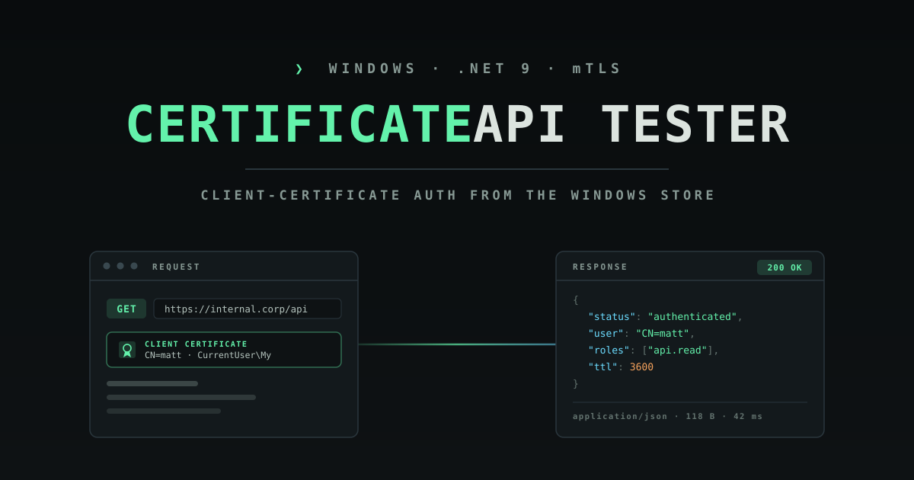

  **A Windows desktop API tester that authenticates to endpoints with a client certificate from your Windows certificate store (mTLS) — and renders whatever the endpoint returns, even when you don't know its format.**

  [](LICENSE)
  [](https://github.com/Real-Fruit-Snacks/windows-cert-api-tester/releases)
  [](#requirements)
  [](https://dotnet.microsoft.com/)
  [](https://github.com/Real-Fruit-Snacks/windows-cert-api-tester/actions/workflows/ci.yml)

  [Documentation](https://real-fruit-snacks.github.io/windows-cert-api-tester/) · [Handbook](wiki/README.md) · [Download](https://github.com/Real-Fruit-Snacks/windows-cert-api-tester/releases/latest) · [Report an issue](https://github.com/Real-Fruit-Snacks/windows-cert-api-tester/issues)

</div>

---

## Overview

Some internal sites and APIs don't take a password — they ask your browser to "choose a certificate," then complete a mutual-TLS handshake with a client certificate issued to you and stored in your Windows certificate store. Testing those endpoints from a normal API client is awkward: most tools want the certificate and its private key as files on disk, which enterprise and smart-card certificates deliberately don't allow.

Certificate API Tester talks to those endpoints directly. You pick a certificate from your Windows store, compose a request, and send it — the operating system performs the signing during the TLS handshake, so the private key never has to leave the store (and never has to be exportable). Because you often only know the endpoint and not the shape of what comes back, the response viewer figures out the format for you and pretty-prints it. And when the target is a **web page** rather than an API, a *Rendered* tab opens it as a browser would — fetching every resource on the page through your certificate. Because the certificate is optional, it also doubles as a general-purpose API client for anything else.

It runs as a single self-contained `.exe` with no external dependencies — no installer, no admin rights, and no .NET runtime required on the machine. Copy the file and run it.

<div align="center">
  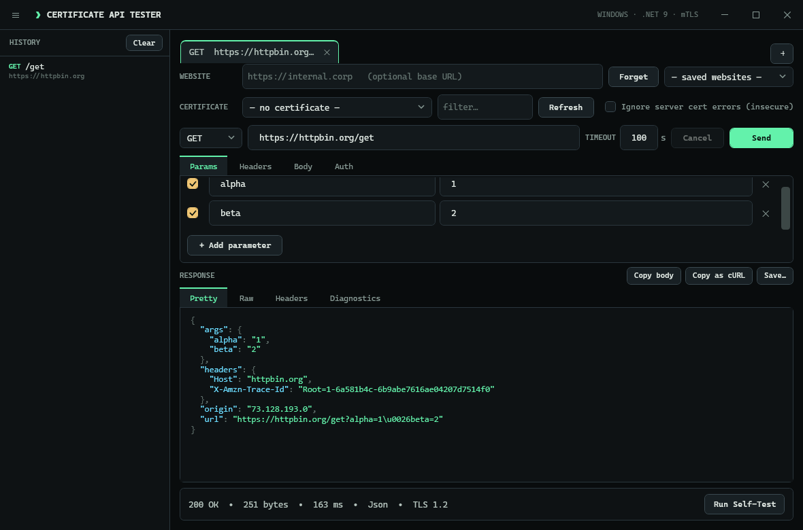
</div>

## Features

- **Pick a client certificate from the Windows store** — lists certificates in `CurrentUser\My` (optionally `LocalMachine\My`) with subject, issuer, thumbprint, and expiry, flags the ones meant for client authentication, and has a filter box for finding one quickly. The private key is never exported; Windows signs the handshake, so smart-card and non-exportable certificates work.
- **Client certificate from a file** — not just the Windows store: load a `.pfx`/`.p12` (with an optional password) or a `.pem`/`.crt` (key in the same file or a separate one) with **From file…** on the certificate row, or headless with `--cert-file` / `--cert-password` / `--key-file` on `send`, `fuzz`, `serve`, and `mcp`. Handy when you're handed a cert that isn't imported into the store.
- **File uploads (multipart/form-data)** — in the app, switch the **Body** tab to **Form data (multipart)** and add fields (tick **File** to upload a file); headless, `certapi send -F "field=value" -F "file=@path"` (curl-style; `-F` implies POST and `name=@path;type=<ct>` sets a part's content type). Multipart requests save into collections and run in suites like any other.
- **Certificate optional — a general API tester too** — leave the picker on **"— no certificate —"** (the default) to send an ordinary request, so it works just as well against endpoints that don't require mutual TLS.
- **Full request builder** — method (GET/POST/PUT/PATCH/DELETE/HEAD/OPTIONS), URL, an enable/disable key-value **query-parameter grid** and **headers grid**, **Bearer/Basic auth** helpers, a request body with a **content-type selector**, a **timeout** field, and a **Cancel** button for in-flight requests.
- **Request tabs** — keep several requests open side by side, each with its own website, method, parameters, headers, body, auth, certificate, and response. Add a tab with `+` or **Ctrl+T**, close it with its `✕` or **Ctrl+W**; your open tabs are there again next time you launch.
- **Query parameters** — a dedicated **Params** tab with an enable/key/value grid. Paste a URL with a `?query` and it splits into the grid automatically; the grid is recombined (correctly encoded) onto the URL when you send.
- **Collections** — save named requests into folders and reopen them in a tab. Switch the sidebar between **History** and **Collections**; save the current request, organise it in folders, rename, or delete. Collections persist between sessions.
- **Known-good endpoints** — every saved request remembers its last result: send it and a dot appears next to its name (mint for a 2xx, red for a failure or error status), with a tooltip showing when it was last checked and what it returned. See at a glance which endpoints are verified working.
- **Request chains** — a **CHAINS** section in the sidebar, beside History and Collections: pick saved requests into an ordered chain (reorder or remove steps, set per-step stop-on-failure, and name the environment its captures write into), so "log in, then call the API" is a saved, named thing rather than a convention about the order of a folder. A token captured by one step is a `{{variable}}` for the next, each step reports PASS/FAIL, and a failing step with stop-on-failure set halts the chain and reports the rest as SKIP. Chains are built **and run** in the app — a **Run chain** button opens a window with a PASS/FAIL/SKIP row per step, selecting a step shows its actual response, and a Stop button cancels a run in progress — and the same chain still runs headless with `certapi run --chain "<name>"` (**Copy run command** still puts that exact line on your clipboard); they travel with an exported workspace like everything else.
- **Data-driven runs** — `certapi run <path> --data users.csv` (or `.json`) repeats a request once per row of a dataset, with each row's columns available as `{{variables}}` — combine with assertions to table-test an endpoint across many inputs in one command.
- **Response assertions (tests)** — a **Tests** tab on any request: assert on the **status**, **response time**, a **header**, a **JSON body path**, or the **body text**, with `==` / `!=` / contains / matches / exists / absent / `<` / `>`. `certapi run` then passes a request only when its assertions all pass (a request with no assertions still passes on any 2xx), so a collection becomes a real pass/fail test suite — failed assertions are listed on stderr and in the JSON output.
- **Response diffing** — ask not just "did it respond" but "did it respond *the same*". `certapi send <url> --diff <baseline>` compares the response against a baseline — a recorded `.har` archive, a `.json` response file (the envelope `certapi send --json` writes, or a saved snapshot), or the literal `known-good` (the stored response of the matching saved request) — and prints what changed. Both sides JSON means a structural diff that names each changed path (`data.items[0].id`); otherwise it falls back to a one-line text summary, and for binary it reports size and equality only. Volatile headers (`Date`, `Set-Cookie`, `ETag`, `Age`, `X-Request-Id`, `X-Correlation-Id`, `Server-Timing`) are ignored by default, and `--diff-ignore data.timestamp` / `--diff-ignore-header X-Trace` add your own. `--diff-fail` makes any difference exit 1 for continuous integration (CI); `certapi run --diff-har session.har` replays a captured session and passes an entry only when its response is identical to the recorded one, which turns a capture into a regression test. In the app, a **Diff** response tab compares against the saved request's known-good response or an archive you pick with **Compare with HAR…**.
- **Environments & variables** — define `{{variable}}` values per environment (Dev / Staging / Prod) and switch from the **ENV** selector in the title bar. Variables are substituted in the URL, query, headers, body, and auth when you send — stored requests keep the raw `{{tokens}}`, and any token with no value is flagged in the status line.
- **Capture & reuse auth tokens** — grab a value from a response (a JSON field like `access_token` or a response header) and save it into a `{{variable}}` automatically. Call your auth endpoint once, then send `Authorization: Bearer {{token}}` on every later request — no copy-paste. Works in the app (a **Capture** tab) and headless (`certapi send --capture token=access_token`).
- **Session cookies** — the app keeps a cookie jar for the session (like a browser), so a login's `Set-Cookie` is sent on later requests automatically; headless, add `--cookies` to `certapi run` to share a jar across a suite.
- **Automatic bearer tokens** — login once and follow-on requests to the same host carry the
  captured token automatically, in the GUI, `certapi send`/`run`, and the MCP server. Host-scoped,
  never overriding explicit auth; `--no-auto-token` / a status-bar toggle opt out. Captured tokens
  are encrypted in your workspace for your Windows user (see [Secrets at rest](#secrets-at-rest)).
- **Collection defaults** — collections remember their website + client certificate, so opening
  any endpoint is immediately sendable.
- **Endpoint discovery** — probe a wordlist against a website to map an undocumented API, in the
  app (**Discover…**) or headless (`certapi fuzz`). Discoveries open as tabs or save as a collection.
- **`--debug` / `--log-file`** — every certapi command can explain exactly what it sent, looked
  up, and negotiated, on screen or into a log file.
- **GraphQL** — `certapi send <url> --graphql "<query>" --gql-variables '{"id":1}'` posts a correctly-formed GraphQL request (JSON `{ query, variables }`), so you can hit GraphQL endpoints from the command line.
- **Import from cURL** — paste a `curl` command and it opens a ready-to-send tab with the method, URL, query, headers, body, and auth filled in (understands `-X`, `-H`, `-d`, `-u`, `-k`, Bearer headers, quoting, and line continuations).
- **Import OpenAPI / Swagger** — point it at a JSON OpenAPI 3.x or Swagger 2.0 file to generate a collection of requests, foldered by tag, with the server as each request's website.
- **Export as OpenAPI** — write the selected folder (or all collections) as an OpenAPI 3.0 JSON file: folders become tags, each saved request becomes an operation with its parameters, headers, and body example, and each known-good note becomes the operation description. Tokens and passwords are never written — auth is exported as a security scheme only.
- **Save / load workspaces** — export everything (open tabs, collections with their known-good results, environments, saved websites, history) to a single JSON file and load it back later, merging into or replacing the current workspace. Move between machines, keep named project snapshots, or hand a teammate a ready-to-use setup.
- **Headless mode (`certapi.exe`)** — the whole tester without the window: send one-off requests with a client certificate from the Windows store, run saved requests and whole collections as pass/fail suites (updating their known-good markers), run a saved chain, bench an endpoint's latency, list certificates, run the mTLS self-test, and import/export cURL, OpenAPI, and workspaces — all scriptable, with body-to-stdout output and meaningful exit codes.
- **Latency & load bench (`certapi bench`)** — `certapi bench https://api.internal/health --cert "CN=matt" -n 500 -c 20` sends the same request over and over through the same certificate-authenticated path and reports how many succeeded, the rate, and the min/p50/p90/p99/max latencies (`--json` for a machine-readable envelope, `--duration <s>` for a wall-clock run, `--warmup <s>` to discard a warm-up period, a saved request instead of a URL if you prefer). Percentiles come from the full latency array, a bench never writes state, and it exits 0 whatever the failure rate as long as something answered — it reports numbers rather than passing judgement — and exits 1 only when nothing did. **Connections are pooled and reused**, so only the first request to an origin pays the TCP connect and TLS handshake — later requests measure the request and response alone; `--warmup` exists to discard that first-connection cost. A request routed through a proxy still opens its own connection every time. Retries are forced off during a bench so a retry can't hide the failure rate it exists to measure (`--bench-retries` measures it anyway). Command-line only — a window would need a chart to add anything.
- **Local mTLS gateway (`certapi serve`)** — run a loopback reverse proxy that forwards to a certificate-protected site: point any local app's base URL at `http://localhost:<port>` and it reaches the upstream with your Windows-store client certificate attached, no mTLS code of its own. Mount several upstreams behind the one port with `--upstream /api=https://api.internal` (repeatable — longest prefix wins, and the prefix is stripped before forwarding). Loopback-only, with an optional shared-secret token.
- **A gateway a web page can call (`certapi serve --browser`)** — one flag turns the gateway into something a browser will actually talk to: Cross-Origin Resource Sharing (CORS) preflights answered locally (`--cors`, optionally restricted to origins you list), `Set-Cookie` rewritten so the browser stores it (`--rewrite-cookies`), upstream redirect targets pointed back at the gateway (`--rewrite-location`), and WebSocket connections relayed through your certificate (`--allow-upgrade`). All opt-in — without them the gateway stays a byte-faithful relay.
- **MCP server for AI agents (`certapi mcp`)** — expose certapi to an AI agent over the Model Context Protocol: it can send mTLS requests, run saved requests and whole chains with their saved transport, assertions, and captures applied, call gRPC services (unary or streaming, via reflection or a pinned descriptor set), and read saved requests, environments, and chains as resources with secrets redacted — all using a certificate you pin at launch and bounded by a host allowlist that is checked on every call, including each chain step. Redirects are never followed, a host pinned with `trust add` needs no `--insecure`, the same proxy/revocation/retry flags as `send` apply, and the workspace is read once and never written back. The agent never handles certificates itself.
- **Rendered website view** — a **Rendered** response tab opens the current URL as a web page, fetching *every* resource (document, CSS, JS, images, XHR) with your selected client certificate — so a certificate-protected internal site renders fully, not just its HTML. It loads on demand and uses the Edge WebView2 runtime included with Windows 11.
- **A response viewer for unknown formats** — reads the `Content-Type` but doesn't trust it blindly: pretty-prints JSON and XML with **syntax highlighting**, shows HTML/text, and hex-dumps binary. When the content type is missing or misleading it *sniffs* the body (JSON → XML → text → binary). Pretty / Raw / Headers / Diagnostics views are always available.
- **Connection diagnostics** — see the negotiated **TLS version and cipher**, whether your client certificate was **actually presented** to the server, and the server's certificate (subject, issuer, thumbprint, expiry, and chain).
- **Network trace** — a **Network** tab, like a browser's network panel: every HTTP call is logged — the request you sent *and* every resource the Rendered view fetches — with method, status, type, size, timing, and a marker when it used your client certificate. Filter by text, status class (2xx–5xx, errors), or cert-only; click a row for a resizable details pane with its headers; right-click to copy the URL or a matching curl command.
- **HTTP Archive (HAR) capture & replay** — `--har trace.har` on `certapi send`, `run`, and `fuzz` records every request (redirect hops included) into a well-formed HAR file, with secret values redacted by default (`--har-include-secrets` to keep them). `certapi import har session.har` turns a captured archive into a collection, and `certapi run session.har` replays its entries as a suite — with your client certificate attached, which is the one thing a browser's own HAR export can never do. In the app, Import ▾ → **Export Network trace as HAR…** and **HAR file…** do the same capture and replay.
- **Per-site server-certificate trust** — pin one server certificate's thumbprint to one host with `certapi trust add <host> --thumbprint <t>` (or `--from-url <https-url>` to capture and pin it in one step) — narrower than the blanket *ignore server cert errors* toggle. `certapi trust list` / `trust remove <host>` manage the pins, and `send`/`run` honor them automatically. In the app, a **Trust & retry** action appears on a certificate-untrusted response, alongside a Trusted-certificates manager (Import ▾ → **Trusted certificates…**).
- **HAR → OpenAPI** — `certapi export openapi --from-har session.har -o api.json` turns a captured session into an OpenAPI 3.0 document: repeated calls to the same endpoint collapse into one operation, identifier-looking path segments become `{id}` (conservatively — only digits, a Universally Unique Identifier (UUID), or a long hexadecimal string, and only when the value actually varies between calls), responses of 400 and above are skipped, and redacted (`[redacted]`) header values are never written. In the app, Import ▾ → **Export OpenAPI from HAR file…** does the same.
- **Mock from HAR** — `certapi mock --har session.har` serves a captured session back as a fake backend instead of the built-in routes: exact method + path + query wins, then method + path, then `--no-match-status` (default 404); repeated calls to a route replay in recorded order and then repeat the last one. In the app, the Mock server window's **From HAR…** button starts a replay the same way.
- **`serve --tls`** — serve the gateway itself over HTTPS on `127.0.0.1` with a generated, cached certificate, so `Secure`, `SameSite=None`, and `__Host-`/`__Secure-` cookies all work through it. The first bind needs an elevated prompt (the exact `netsh` command is printed when one isn't available); `--tls-trust` installs the certificate so the browser stops warning, reversibly, with `--tls-untrust`.
- **`serve --cors` answers Chrome's Private Network Access (PNA) preflight, and forwarded traffic gets header rules** — a page on a public origin calling a private or loopback address gets a further preflight Chrome requires answering before it will let the request through at all; the gateway answers it only for an origin the existing `--cors` allowlist already accepts, and `--cors-max-age <seconds>` controls how long the browser may cache that answer (default 600, unchanged). Independently of `--browser`, `--request-header`/`--response-header "Name: value"` set (replace or add) a header on the way through and `--remove-request-header`/`--remove-response-header <name>` strip one — repeatable, removal wins over setting, and the handful of headers that frame the HTTP message (plus `Host`) are refused with a usage error rather than silently ignored.
- **gRPC (`certapi grpc`)** — call a gRPC service (HTTP/2) that requires a client certificate, using the same Windows-store certificate handling as everything else — the reason to reach for this instead of `grpcurl` when the service sits behind mutual TLS. `certapi grpc list <address>` discovers the services and methods a server advertises via server reflection; `certapi grpc call <address> <Service/Method> -d '<json>'` invokes one — unary, server-streaming, client-streaming, or bidirectional, with the kind coming from the service's own definition rather than a flag — JSON in and JSON out: a unary response prints as indented JSON, a server-streaming or bidirectional one prints a compact JSON object per line as each message arrives (`--max-messages <n>` stops it early). For a client-streaming or bidirectional method, each repeated `-d` and each line read from standard input is sent as one message. A host pinned with `certapi trust add` needs no `--insecure`, exactly as `certapi send`. The well-known Protobuf types render — and are accepted on the way in — in their canonical forms rather than as ordinary messages: a `Timestamp` prints as `"2023-11-14T22:13:20Z"`, an RFC 3339 string, not `{"seconds":…,"nanos":…}`. A server that doesn't expose server reflection can still be listed and called: supply a compiled descriptor set with `--protoset <file>` — the binary output of `protoc --descriptor_set_out=<file> --include_imports <proto>`, the same format `grpcurl -protoset` takes — which wins over reflection whenever both are available, and `certapi grpc list --protoset <file>` works entirely offline, with no address and no connection to the service at all. **The honest limits:** `--protoset` only helps if you already have, or can produce, the descriptor set yourself — certapi doesn't compile `.proto` sources — and `certapi serve` does not proxy gRPC.
- **Pop-out response views** — open a single response view *or the whole response panel (tabs and all)* in its own window: detach the panel to give the request editor the full main window, or pop just the Network trace or a Rendered page beside your work. Everything stays live — the trace keeps streaming, a Rendered page stays interactive — and closing a popped-out window puts its content back.
- **Saved websites** — save a base URL (e.g. `https://internal.corp`) and the URL box becomes just the path after it, so you can fire off `/api/thing`, `/api/other` without retyping the host.
- **Request history** — a sidebar of recent requests, labelled by path (with the host beneath). Click one to reload the *entire* request — website, certificate, headers, auth, timeout, and body — **and** the response it returned. The app also remembers your window, last certificate, and settings between runs.
- **Copy as code** — turn the current request into a snippet with **Copy as ▾**: cURL, PowerShell (`Invoke-RestMethod`), Python (`requests`), or C# (`HttpClient`) — variables resolved, headers and body included — to drop into a script or hand to a teammate.
- **Find in response** — a search box over the response body finds and selects the next match (Enter for next, wrapping around) — handy for locating a value in a large JSON payload.
- **Copy & export** — copy the response body, copy the request as code, and save any response (including binary) with a sensible file extension.
- **Clear failure messages** — distinguishes "server refused the certificate," "the server's certificate was revoked" (a distinct outcome from the one below, not folded into it), "the server's own certificate isn't trusted," a network/DNS error, and a timeout.
- **The detail behind a failure** — a failed connection also carries the underlying exception chain and socket error code, which is where the SChannel status for a *refused client certificate* actually lives. `--debug` prints it, `--json` includes it as a structured error, and the app's **Diagnostics** panel shows it.
- **Reach internal sites behind a private CA** — an explicit, off-by-default *Ignore server certificate errors* toggle (clearly labelled insecure).
- **Certificate revocation checking** — `--revocation none|offline|online`, defaulting to `none` (today's behavior, unchanged for existing setups). `offline` checks cached certificate revocation lists (CRLs) only; `online` may also query an Online Certificate Status Protocol (OCSP) responder or fetch a fresh CRL. A revoked certificate is its own outcome and is refused even past a pinned thumbprint from `certapi trust add` — revocation is the issuer's later word, and it wins over an earlier pin. An indeterminate status (common on a locked-down corporate network) is reported but not fatal unless you add `--revocation-strict`. The outcome — checked-and-good, revoked, unknown, or not checked — is always reported, in `--debug`, `--json`, and the app's Diagnostics panel; a REVOCATION row on the Transport tab sets it for a saved request.
- **Honors your proxy — or overrides it** — by default it follows the machine's configured proxy, including "Automatically detect settings" (WPAD) and a "Use automatic configuration script" (PAC) from Internet Options, authenticating with your Windows credentials when required. Send through a different proxy with `--proxy` (plus `--proxy-user` when it authenticates), or skip the proxy entirely with `--no-proxy` — which also brings back the TLS version, cipher, and certificate-presented details, since none of those are visible through a proxy.
- **Transport control per request** — override or bypass the proxy (or narrow it to specific hosts with a `--noproxy` bypass list), follow redirects or stop at the 3xx (with your own hop limit), turn automatic decompression off, and pin the HTTP version. It's a **Transport** tab in the app's request editor, saved with the request, and the same switches headless on `send`, `run`, and `fuzz`: `--no-redirect` / `--max-redirs <n>`, `--no-decompress`, `--http1.1` / `--http2`.
- **Retries with backoff** — `--retry 3` on `send`, `run`, and `fuzz` survives a flaky internal endpoint without a shell loop: retry on `429,502,503,504` by default (`--retry-on`), starting at 500 ms (`--retry-delay`) and doubling with ±10% jitter to a 30-second cap, and honoring a server's `Retry-After` when it sends one. Only idempotent methods (GET/HEAD/OPTIONS/PUT/DELETE) retry unless you add `--retry-unsafe`, because re-sending a POST nobody confirmed can charge a card twice; a refused or untrusted certificate is never retried, since it would only fail slower. Connection failures and timeouts retry too (`--no-retry-transport` opts out), Ctrl+C is honored during the wait, and the metadata line and `--json` envelope report how many attempts it took. It's a **Retries** group on the app's Transport tab, saved with the request.
- **See every redirect** — redirects are followed by the tester itself and reported instead of happening invisibly: `--show-redirects` prints the hop chain (it's in `--json` too, and each hop is a row in the app's **Network** trace). A hop that crosses to another origin is flagged — that's where the `Authorization` header gets dropped, and where your client certificate would be presented to a host you never chose.
- **Pin a hostname to an address** — `--resolve host:port:ip` connects to the address you name while the request still carries the original hostname, so you can test one node behind a load balancer, or verify a Domain Name System (DNS) cutover before it goes live. `certapi send --all-ips` does the whole sweep for you — one send per address the host resolves to, with a per-address comparison (status, time, size).
- **Built-in self-test** — a *Run Self-Test* button stands up a local mutual-TLS server on your own machine and proves the whole certificate-authentication path end to end, **no real endpoint required.**
- **Local test server** — a *Mock server…* button (and `certapi mock`) runs a standing server you can fire requests at: it echoes each request as JSON and serves `/status/<code>`, `/sse`, `/token`, `/windows-auth`, `/cookie-auth`, and a WebSocket echo, over plain HTTP, HTTPS, or mutual TLS (it generates and writes out the certs). Point the app at itself to try every feature without a real API.
- **Built-in help** — a **?** in the title bar (or **F1**) opens a Help & Reference window that walks through every feature, lists the keyboard shortcuts, and shows an About panel. It's all embedded, so it works even with no web access.
- **OAuth 2.0 tokens** — a *Get OAuth 2.0 token…* button on the Auth tab runs the client-credentials, password, and refresh grants, plus the authorization-code grant with PKCE (opens your browser, catches the loopback redirect). The token is stored for the API's host and filled into the Bearer field. `certapi token` does the same headless. The token endpoint itself can be mTLS-protected.
- **Windows Integrated Auth (Negotiate/NTLM)** — for internal sites that use your Windows identity. A *Windows (integrated)* auth type signs in with your logged-in account (SSO) by default, or explicit `DOMAIN\user` + password. Headless: `certapi send --windows-auth` (or `--windows-user`/`--windows-password`). Kerberos or NTLM is negotiated automatically.
- **Session capture** — for sites you log into through a web page. A *Capture session…* button opens a browser (presenting your client certificate); you log in on the site itself, and it captures the resulting session cookies and any bearer token — scoped per website and attached automatically to later requests, in the app and headless via `certapi`. It can also save the API calls it saw as a ready-to-run collection. Your password is never seen or stored.
- **Live streaming (WebSocket & SSE)** — a *Stream* button opens a console that connects to a `ws://`/`wss://` endpoint (send messages, watch replies) or an `http(s)` `text/event-stream` endpoint (watch events arrive), reusing your selected client certificate. The `certapi ws` and `certapi sse` commands do the same headless.
- **Light or dark theme** — the Terminal Workbench palette ships in both. Toggle it from the sun/moon button in the title bar; your choice is remembered and applies to every window.
- **Keyboard-friendly and portable** — shortcuts for everything (below), a fully themed UI, and a single self-contained executable.

## Using it

### Send your first request
1. **Pick a certificate** in the CERTIFICATE row (or leave it on *"— no certificate —"* for a plain request). The filter box finds one quickly among many.
2. Choose a **method** and type a **URL** (a full `https://…`, or a path if you've saved a website).
3. Press **Send** (or **Ctrl+Enter**). The response appears below: **Pretty** highlights JSON/XML, **Raw** shows the exact bytes, **Headers** and **Diagnostics** (TLS version, cipher, whether your certificate was presented) round it out.

### Save a base URL (websites)
Type a base like `https://internal.corp` in the WEBSITE row and click the saved-websites arrow to keep it. The URL box then takes just the path (`/api/thing`), so you don't retype the host.

### Organise requests (collections)
Switch the sidebar to **COLLECTIONS**, then **Save current request…** to store it in a folder. Double-click a saved request to reopen it in a tab. Each saved request shows a **known-good dot** after you send it — mint for a 2xx, red for a failure — with a tooltip of when it was last checked.

### Discovering endpoints

No API docs? Probe candidate endpoints to see what exists. With no wordlist it uses a built-in
starter list, so this just works out of the box:

    certapi fuzz https://api.example.com --cert "CN=My Client"

For a thorough sweep, supply your own (larger) list with `-w` — the built-in one is only a quick
look. A copy of it ships as [`wordlists/common-api-endpoints.txt`](wordlists/common-api-endpoints.txt):

    certapi fuzz https://api.example.com -w my-endpoints.txt --cert "CN=My Client"

Each line is a path (or `METHOD path`); `#` comments and blanks are ignored. Anything but a 404 or
a connection error counts as a discovery. Add `--save-collection Discovered` to keep the hits, or
`--json` for machine output. In the app, use **Discover…** in the toolbar (with a **Use built-in
list** button).

<p align="center">
  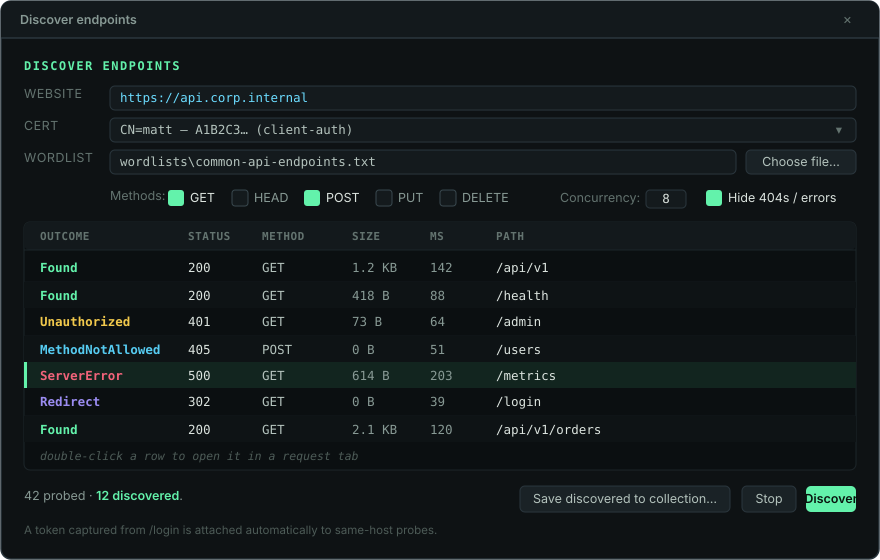
</p>

Results are colour-coded by outcome — **Found** (2xx), **Unauthorized** (401/403, it exists but
needs auth), **MethodNotAllowed** (405, it exists with a different method), **Redirect**,
**ServerError**, and **NotFound**. 404s and connection errors are hidden by default. A token
captured from an auth endpoint is reused automatically on later probes to the same host, so you can
log in first and then discover the endpoints that need it. The same run headless:

<p align="center">
  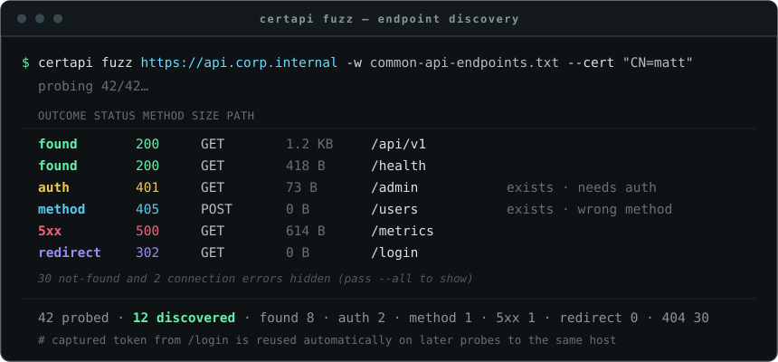
</p>

### Testing responses

Turn a saved request into a real test with the **Tests** tab: add assertions on the response and
`certapi run` will pass the request only when they all hold.

- **Target:** Status · Time (ms) · a Header · a Body JSON path (e.g. `data.id`) · the Body text
- **Comparison:** `==` · `!=` · contains · matches (regex) · exists · absent · `<` · `>`

For example, assert `Status == 200`, `Body data.id exists`, and `Time < 500`. Run the suite:

    certapi run smoke-suite --json

A request with no assertions still passes on any 2xx (unchanged), so adding tests is opt-in per
request. Failed assertions are printed on stderr (`… assertion failed — Status == 200 (got 503)`)
and included in `--json`, and the app shows a `✓ tests 3/3 passed` summary with the detail in the
**Diagnostics** view.

### Environments & variables
Open the **ENV** selector (title bar) → **Edit** to define `{{variable}}` values per environment (Dev / Staging / Prod). Use `{{name}}` anywhere — URL, query, headers, body, or the auth fields — and it's substituted when you send. Switch environments to point the same requests at a different backend.

### Capture & reuse an auth token
Many APIs want you to log in first and then send the returned token on every call. Do it once and reuse it automatically:
1. Build the **login request** (e.g. `POST https://internal.corp/auth` with your credentials in the body).
2. Open its **Capture** tab → **+ Add capture**. Set **Variable** = `token`, **From** = `Body`, **Path** = `access_token` (use a dotted path like `data.access_token` for nested fields, or **From = Header** with a header name).
3. **Send** the login request. The status line shows `Captured token`, and the value is saved into your active environment (a `Captured` environment is created automatically if you don't have one selected) as a variable marked **secret**, so it's encrypted in the workspace/state file rather than stored in plain text (see [Secrets at rest](#secrets-at-rest)).
4. In your other requests, set **Auth → Bearer** with the token `{{token}}` (or put `{{token}}` in any header). Send — the captured token is filled in. Re-run the login request anytime to refresh it.

### Import / export
- **Import ▾** (next to the tabs): paste a **cURL** command, or import an **OpenAPI/Swagger** JSON file to generate a whole collection.
- **Export**: write a collection as **OpenAPI** (from the collections sidebar), or **Export workspace** to move everything — tabs, collections, environments, history — to another machine. Secrets (captured tokens/cookies, saved auth values, secret variables, stored response bodies) are written encrypted for your Windows user, so they don't travel to a different user or machine; the headless `certapi export workspace` strips them by default instead (see [Secrets at rest](#secrets-at-rest)).

### Headless (the `certapi` command-line tool)
`certapi.exe` (a separate download on the releases page) does everything without the window:

```powershell
# one-off request with a client certificate from the Windows store
certapi send https://internal.corp/api/orders --cert "CN=matt"

# log in and capture the token into a workspace, then reuse it
certapi send https://internal.corp/auth --cert "CN=matt" --capture token=access_token --workspace team.json
certapi send https://internal.corp/api/orders --workspace team.json --env Captured -H "Authorization: Bearer {{token}}"

# run saved requests as a pass/fail suite (exit code 1 if any fail)
certapi run "internal api" --env Prod
certapi run --all --json

# fetch an OAuth 2.0 token and store it for later sends to the API
certapi token --token-url https://auth.internal.corp/token --client-id app --client-secret s3cret \
    --scope "api.read" --save --for https://api.internal.corp
certapi send https://api.internal.corp/orders

# Windows Integrated Auth (Negotiate/NTLM) with your signed-in account
certapi send https://intranet.corp/api/me --windows-auth

# route through a corporate proxy (--proxy-user user:pass if it authenticates)
certapi send https://internal.corp/api/orders --cert "CN=matt" --proxy http://proxy.corp:8080

# bypass the proxy — this is also what brings the TLS/cipher/cert-presented diagnostics back
certapi send https://internal.corp/api/orders --cert "CN=matt" --no-proxy

# through the proxy, except for the intranet (NO_PROXY conventions; NO_PROXY is honored too)
certapi send https://internal.corp/api/orders --cert "CN=matt" --proxy http://proxy.corp:8080 --noproxy ".corp,10.0.0.0/8"

# follow redirects and print every hop (flags a cross-origin hop and a dropped Authorization)
certapi send https://internal.corp/login --show-redirects

# pin a hostname to one address — a single node behind a load balancer, or a DNS cutover
certapi send https://api.internal.corp/health --resolve api.internal.corp:443:10.4.7.21

# stream a WebSocket (send messages, print replies) or Server-Sent Events
certapi ws wss://internal.corp/socket --cert "CN=matt" -m '{"sub":"prices"}' --expect 3
certapi sse https://internal.corp/events --cert "CN=matt" --max-events 5 --json

# utilities and import/export
certapi certs --filter matt
certapi selftest
certapi import openapi .\spec.json --into imported
certapi export workspace -o team-setup.json               # strips secrets by default
certapi export workspace -o team-setup.json --include-secrets   # keeps them, encrypted for you

# run a local test server and fire requests at it (try --tls or --mtls too)
certapi mock --port 8770
certapi send http://127.0.0.1:8770/anything -X POST -d '{"hi":1}'

# serve a captured HAR back as a fake backend — no live traffic needed
certapi mock --har session.har --port 8770

# capture a session as a HAR file, then replay it later through mutual TLS
certapi send https://api.internal/health --cert "CN=matt" --har trace.har
certapi import har .\session.har --into imported
certapi run session.har --cert "CN=matt"

# turn a captured HAR session into an OpenAPI document
certapi export openapi --from-har session.har -o api.json

# pin the server certificate a specific host must present, instead of ignoring errors wholesale
certapi trust add internal.corp --from-url https://internal.corp
certapi trust list

# call a gRPC service that requires a client certificate — discover it, then call it
certapi grpc list https://api.internal.corp:5001 --cert "CN=matt"
certapi grpc call https://api.internal.corp:5001 my.pkg.Greeter/SayHello -d '{"name":"Ada"}' --cert "CN=matt"
certapi grpc call https://api.internal.corp:5001 my.pkg.Feed/Watch --cert "CN=matt" --max-messages 5
```

Saved requests, collections, and environments come from the app's own state automatically, or from any exported workspace file via `--workspace` — so it works on machines that have never opened the app. Run `certapi help <command>` for every option. Response bodies go to stdout and diagnostics to stderr, with script-friendly exit codes (0 success · 1 failure · 2 usage · 3 data).

### Local gateway (for apps that can't do client certificates)
Point any app's base URL at a local port and it reaches a certificate-protected site with your certificate attached:

```powershell
certapi serve https://internal.corp --port 8819 --cert "CN=matt"
# then the app calls http://localhost:8819/api/orders

# two upstreams behind one port: /api/orders reaches https://api.internal/orders
certapi serve --port 8819 --cert "CN=matt" --upstream /api=https://api.internal --upstream /auth=https://login.internal

# everything a single-page application in the browser needs (CORS, cookies, redirects, WebSockets)
certapi serve https://internal.corp --port 8819 --cert "CN=matt" --browser

# serve the gateway itself over HTTPS, so Secure/__Host-/__Secure- cookies survive too
certapi serve https://internal.corp --port 8819 --cert "CN=matt" --browser --tls --tls-trust

# inject a header the calling app can't set itself, whether or not --browser is on
certapi serve https://internal.corp --port 8819 --cert "CN=matt" --request-header "X-Api-Key: s3cret"
```

Loopback only; add `--token <value>` to require a shared secret.

`--browser` is a bundle over `--cors`, `--rewrite-cookies`, `--rewrite-location`, and
`--allow-upgrade`, each of which also works on its own; with none of them the gateway behaves exactly
as it always has — a byte-faithful relay for callers that never wanted a browser. Over the default
plaintext `http://127.0.0.1` origin, a cookie named `__Host-…` or `__Secure-…` still can't work — it
requires the `Secure` attribute, which no browser accepts on plaintext loopback — so it's relayed and
named in a warning rather than silently dropped. `--tls` is the fix: it serves the gateway itself over
HTTPS with a generated certificate, so `Secure`, `SameSite=None`, and those cookie prefixes all work.
The first bind needs an elevated (Run as administrator) prompt; `--tls-trust` optionally installs the
certificate so the browser stops warning about it.

Chrome also runs a Private Network Access (PNA) check before it lets a page on a public origin reach
a private or loopback address at all, and `--cors` answers it — but only for an origin the same
allowlist already accepts, so PNA never becomes a way around it; `--cors-max-age <seconds>` sets how
long the browser may cache that preflight answer (default 600, so nothing changes if you don't set
it). Allowing a public origin to reach a loopback service is a real exposure even with PNA answered,
which is why naming the origins you develop from with `--cors <origins>` is safer than leaving it
echoing whoever asks. Separately, `--request-header`/`--response-header "Name: value"` and
`--remove-request-header`/`--remove-response-header <name>` set or strip a header on forwarded
traffic — repeatable, removal wins over setting, and they apply with or without `--browser`. The
handful of headers that frame the HTTP message (`Connection`, `Content-Length`, and the rest) plus
`Host` are refused with a usage error rather than silently ignored.

### MCP server (for AI agents)
Give an AI agent controlled use of your certificate over the Model Context Protocol. Configure your MCP host:

```json
{ "mcpServers": { "certapi": {
  "command": "certapi",
  "args": ["mcp", "--cert", "CN=matt", "--allow", "internal.corp"] } } }
```

The agent gets `send_request`, `list_certificates`, `list_saved`, `run_saved`, and `self_test` — always using the certificate you pinned, and only reaching hosts on the `--allow` list.

## Screenshots

**Capture a browser login — log in on the site itself, and the session cookies and any token are captured and reused automatically (your password is never seen)**

<div align="center">
  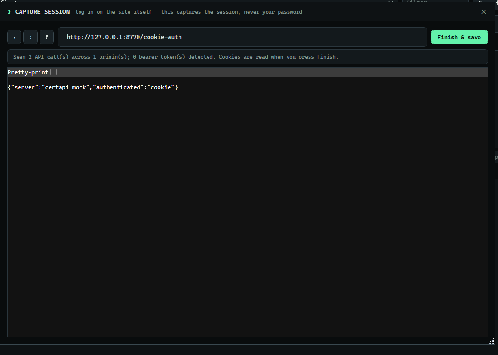
</div>

**Render a certificate-protected website — every resource (HTML, CSS, JS, images, XHR) is fetched with your client certificate**

<div align="center">
  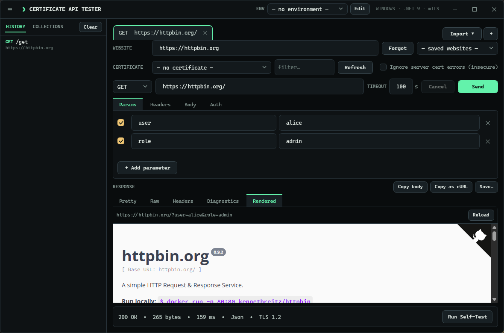
</div>

**Organise saved requests into collections — with known-good markers — and switch between environments of `{{variables}}`**

<div align="center">
  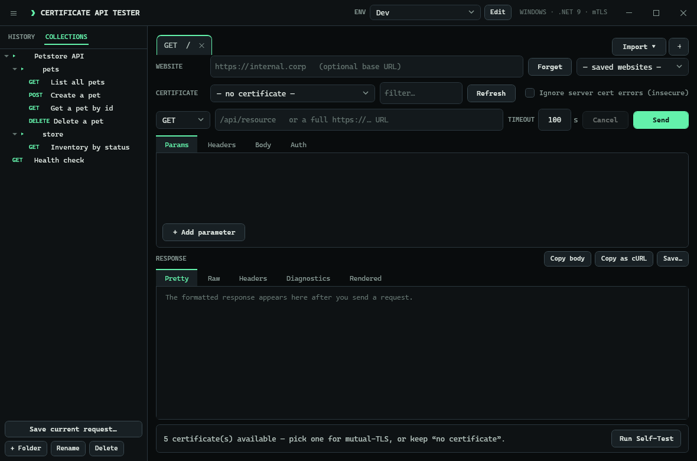
  <br/><br/>
  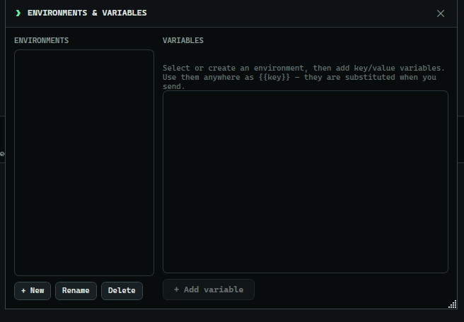
</div>

**A network trace — every request the page made, like a browser's network panel, each fetched through your certificate**

<div align="center">
  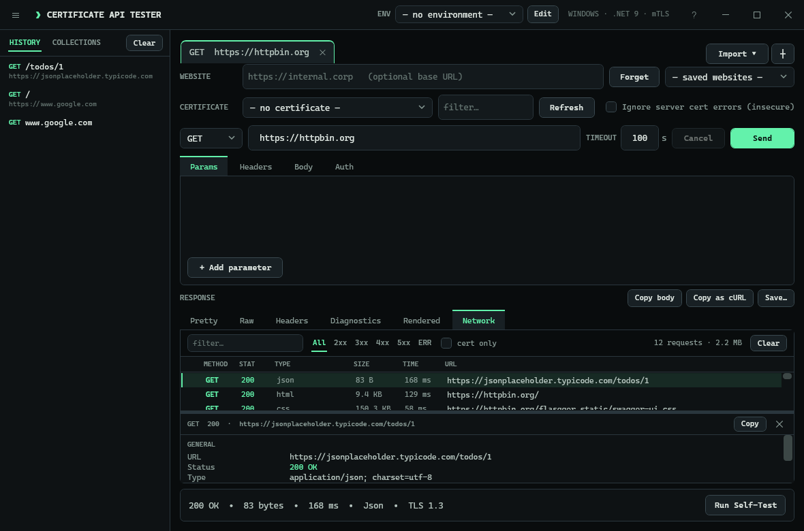
</div>

**A built-in mock server — echoes requests and serves `/status`, `/sse`, `/token`, `/windows-auth`, `/cookie-auth`, and a WebSocket echo, over HTTP / TLS / mTLS**

<div align="center">
  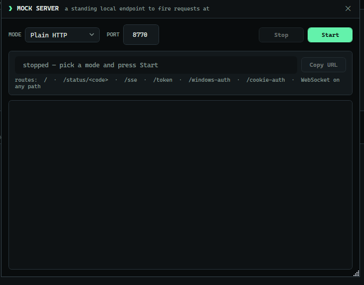
</div>

**`certapi` — the same engine without the window, for scripts, CI, and scheduled checks**

<div align="center">
  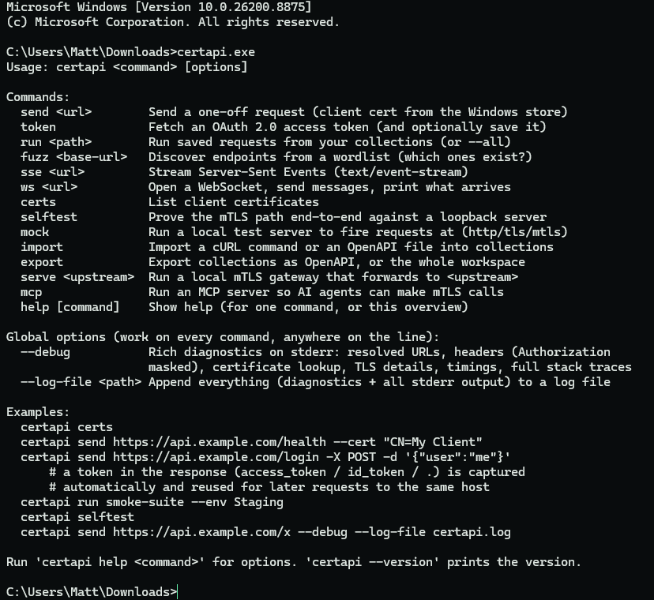
</div>

**Built-in Help & Reference — every feature explained, embedded so it works with no web access**

<div align="center">
  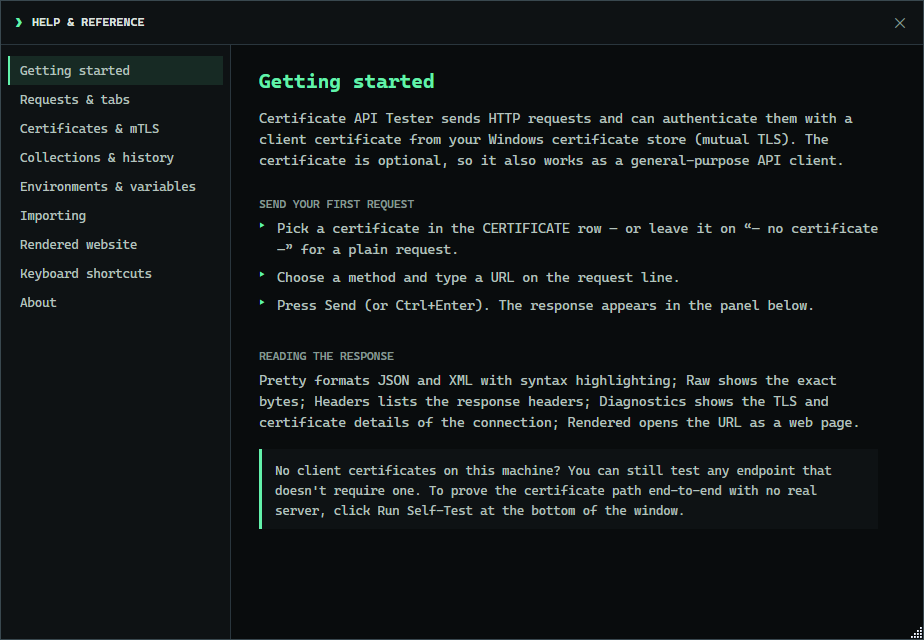
</div>

**Run it headless as a local gateway — an app points its base URL at the port and reaches a certificate-protected site with no mTLS code of its own**

<div align="center">
  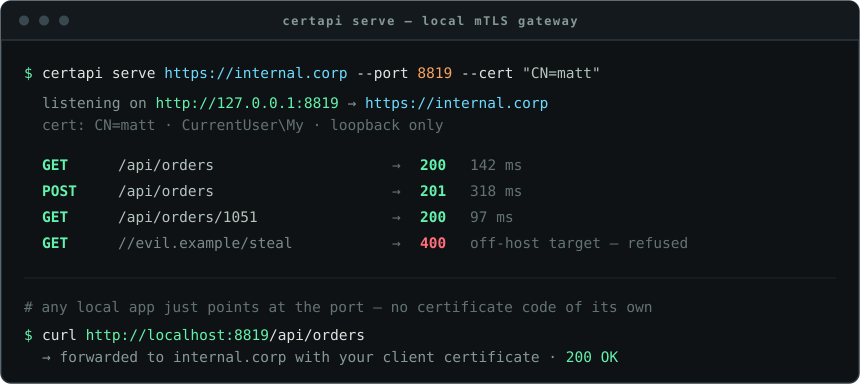
</div>

## Requirements

- **To run:** Windows 10 or 11 (64-bit). Nothing else — the released `.exe` bundles the .NET runtime.
- **To build:** the [.NET 9 SDK](https://dotnet.microsoft.com/download) on Windows.

## Download

Grab `ApiTester.App.exe` from the [latest release](https://github.com/Real-Fruit-Snacks/windows-cert-api-tester/releases/latest) and double-click it. There is no installer and it needs no admin rights — copy it wherever you like and run it. The command-line client `certapi.exe` is a separate asset on the same releases page.

## Quick start

1. **Pick a certificate** — or leave it on *"— no certificate —"* to send a plain request. Use the filter box to find one among many.
2. **Compose the request** — choose a method, type a URL, and (optionally) add headers, a body with its content type, or Bearer/Basic auth.
3. **Send** (or press **Ctrl+Enter**) and read the response. The **Pretty** tab highlights JSON/XML; **Diagnostics** shows the TLS and certificate details of the connection.

To sanity-check the certificate path with no real endpoint, click **Run Self-Test** — it runs a full mutual-TLS round-trip against a local server on your own machine.

### Endpoints to try

- **Mutual TLS:** import the test client certificate from [badssl.com/download](https://badssl.com/download/) (`badssl.com-client.p12`, password `badssl.com`) into `CurrentUser\My`, select it, and hit `https://client.badssl.com/` — it returns `200` with the cert and `400` without.
- **Server-cert toggle:** `https://self-signed.badssl.com/` fails as *ServerCertificateUntrusted* until you enable *Ignore server certificate errors*.
- **General (no cert):** `https://httpbin.org/anything`, `https://postman-echo.com/get`, `https://jsonplaceholder.typicode.com/todos/1`.
- **Formats:** `https://httpbin.org/xml`, `/html`, `/image/png` (binary → hex dump).

## Keyboard shortcuts

| Shortcut | Action |
| --- | --- |
| `Ctrl+Enter` / `Enter` in the URL box | Send the request |
| `Esc` | Cancel an in-flight request |
| `Ctrl+L` | Focus the URL box |
| `Ctrl+S` | Save the response |
| `Ctrl+H` | Toggle the history sidebar |
| `Ctrl+T` | New request tab |
| `Ctrl+W` | Close the current tab |
| `F5` | Refresh the certificate list |
| `F1` | Open the in-app help |

## Build from source

```bash
git clone https://github.com/Real-Fruit-Snacks/windows-cert-api-tester.git
cd windows-cert-api-tester

dotnet build                                       # compile
dotnet test --filter "Category!=StoreRoundTrip"    # unit + mTLS integration tests
dotnet run --project src/ApiTester.App             # launch the app
```

The `TlsBinding` category is opt-in too, and does nothing unless the environment variable
`CERTAPI_TLS_BINDING_TESTS=1` is set — the suite must never touch the machine's certificate bindings.

Produce the portable single-file executable:

```bash
dotnet publish src/ApiTester.App -c Release -r win-x64 --self-contained -o publish
# -> publish/ApiTester.App.exe   (runs on any Windows 10/11 machine, no install)

dotnet publish src/ApiTester.Cli -c Release -r win-x64 --self-contained -o publish
# -> publish/certapi.exe         (the command-line client)
```

> The runtime-identifier and self-contained flags live on the publish command, not in the project file, so everyday `dotnet build` / `dotnet test` stay fast and framework-dependent.

## No external dependencies

- **Running it:** the released `ApiTester.App.exe` is a self-contained single file. Copy it to any Windows 10/11 machine and run it — no installer, no admin rights, and no pre-existing .NET runtime.
- **One optional exception:** the *Rendered* website view uses the Microsoft Edge **WebView2 runtime**, which ships with Windows 11 (and is a standard component on up-to-date Windows 10). It loads only when you open that tab; if the runtime is absent, the tab says so and everything else works unchanged.
- **`certapi grpc` is built on `Grpc.Net.Client`/`Google.Protobuf`, and they're compiled in too:** the claim above is about *install* requirements, not about the absence of libraries. Those packages (plus `Grpc.Reflection`) live in a dedicated `ApiTester.Grpc` project referenced only by the command-line client — the desktop application and every other command are unaffected — and, like WebView2's loader, they're compiled into `certapi.exe` itself. There's still no installer, no admin rights, and no runtime to add.
- **Building it on your own CI:** the repository includes a [`.gitlab-ci.yml`](.gitlab-ci.yml) so a self-hosted GitLab instance can build, test, and package the executable on a Windows runner, and optionally publish this documentation site to GitLab Pages. Point NuGet at your own package mirror if you use one — building from source now restores `Grpc.Net.Client`, `Grpc.Reflection`, and `Google.Protobuf` too.

## How it works

- **Authentication is mutual TLS.** The app builds an `HttpClient` over a `SocketsHttpHandler` and attaches the certificate you picked. During the handshake the server requests a client certificate and the app presents yours. For non-exportable keys (enterprise CAs, smart cards) the signing is done by Windows CNG/CryptoAPI — the application never sees the raw private key.
- **The rendered view browses through your certificate.** The *Rendered* tab hosts a WebView2 and intercepts *every* resource it requests — the document, styles, scripts, images, and XHR — fetching each through the same client-certificate `HttpClient`, so an entire certificate-protected page renders authenticated, not just its first response.
- **The response is decoded defensively.** Content-type is a hint, not a guarantee, so the formatter validates before it trusts and sniffs when it can't.
- **Diagnostics are captured from the live connection.** For direct connections the app performs the TLS handshake itself so it can report the negotiated protocol/cipher and whether your client certificate was actually presented; the server certificate and chain are always captured. Connections are pooled and reused, and the diagnostics reported are those of the handshake that established the connection in use — a second request to the same origin reports the same protocol, cipher, and client-certificate-presented values rather than forcing a fresh handshake just to observe them. A connection is only ever reused by a request with an identical client certificate and trust policy, so those values are always true of the request that's showing them.
- **Your proxy is respected.** Requests follow the machine's configured proxy (WPAD/PAC from Internet Options) and authenticate to it with your Windows credentials when required. It can also be narrowed per host with a `--noproxy` bypass list, so hosts that should be reached directly are.
- **The self-test is real.** It generates an in-memory CA plus a server and client certificate, runs a `TcpListener` + `SslStream` server that *requires* a client certificate, and drives a real request through the same code path the app uses for live endpoints.

## Project layout

```
windows-cert-api-tester/
├── src/
│   ├── ApiTester.Core/     Engine — cert store access, mTLS client, response formatting, self-test
│   ├── ApiTester.App/      WPF desktop UI (a thin layer over Core)
│   ├── ApiTester.Cli/      certapi — the headless command-line client
│   └── ApiTester.Grpc/     gRPC/Protobuf support for `certapi grpc` (the one project with those deps)
├── tests/
│   └── ApiTester.Tests/    Unit tests + an end-to-end mutual-TLS integration test
├── .github/workflows/      Build/test CI and the release pipeline
├── .gitlab-ci.yml          Self-hosted GitLab build + Pages
└── docs/                   Documentation site and artwork
```

The engine (`ApiTester.Core`) has no UI dependency, so every behaviour is covered by tests without touching the window.

## Security

- Client certificates are **never exported**; the live `X509Certificate2` is handed to the networking layer and Windows performs the signing.
- *Ignore server certificate errors* is **off by default** and clearly labelled insecure — turn it on only for internal sites whose server certificate you trust.
- The app makes no network calls other than the requests you send. There is no telemetry. Window and request settings are stored locally under `%AppData%\CertApiTester`.

### Secrets at rest

Everything lives in one workspace file, `%AppData%\CertApiTester\state.json`. Most of it — request
definitions, collections, chains, history, environment names — is plain, readable JSON, so the file
stays diffable and debuggable. The secrets in it are not: a captured bearer token, a browser-captured
session cookie, a saved request's Basic-auth password or bearer token, any environment variable
ticked **secret**, and stored response bodies — the ones kept in history entries and in a saved
request's known-good snapshot — are encrypted with the Windows Data Protection API (DPAPI), scoped to
the Windows user who saved them.

The consequence: a `state.json` copied to another Windows user, or to another machine, still opens
with everything intact **except those secrets**, which cannot be decrypted there and are dropped or
left empty rather than crashing the load. `certapi export workspace` strips secrets — including those
stored bodies — by default for the same reason exported HTTP Archive (HAR) files are redacted by
default — an exported workspace is a file people email around — pass `--include-secrets` to keep them
(still encrypted for you, never in the clear).

## License

Released under the [MIT License](LICENSE).
